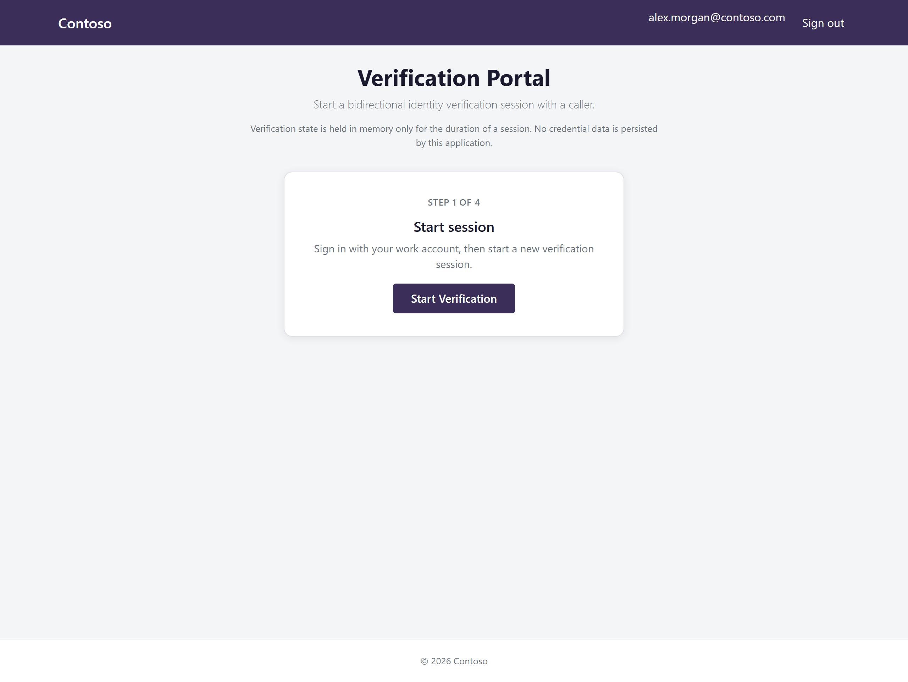
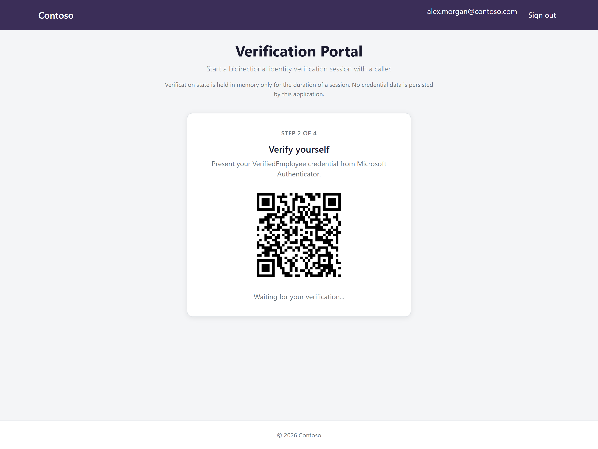
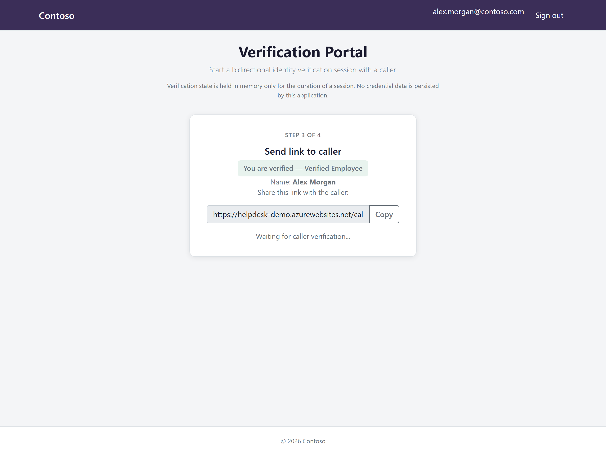
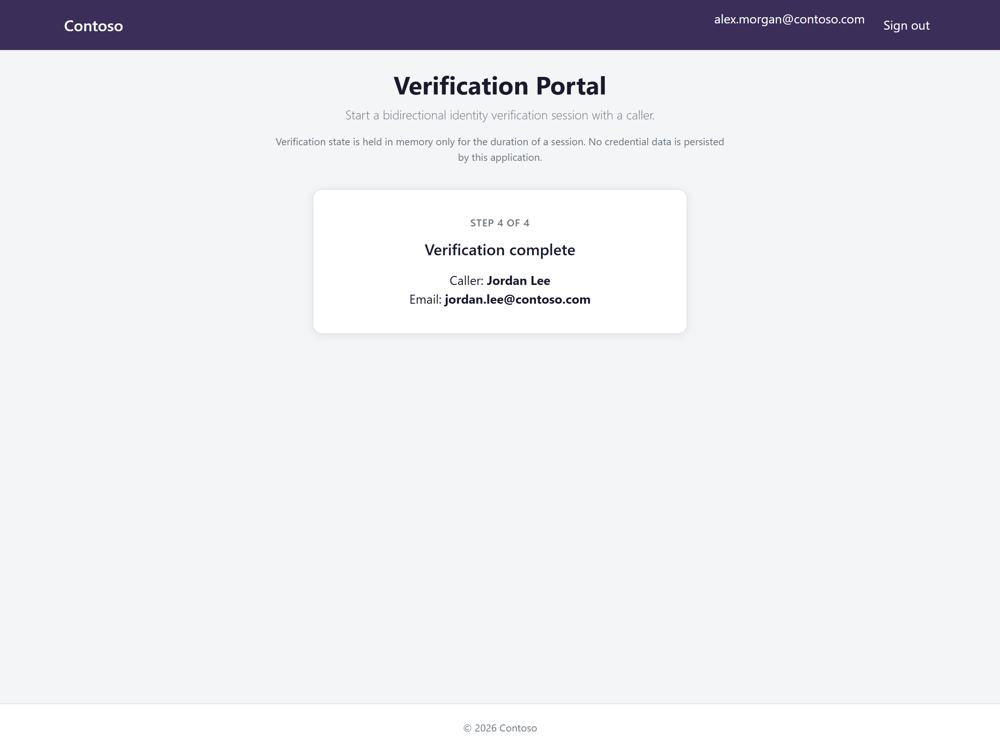
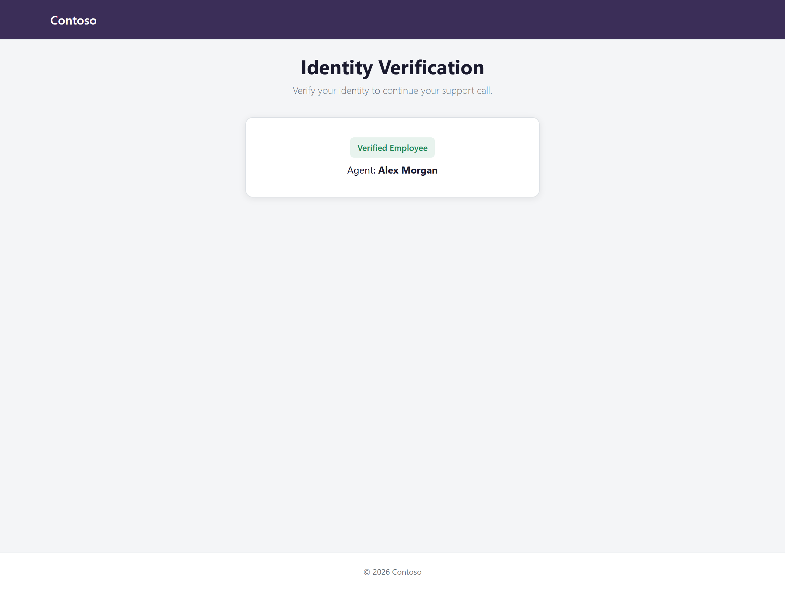
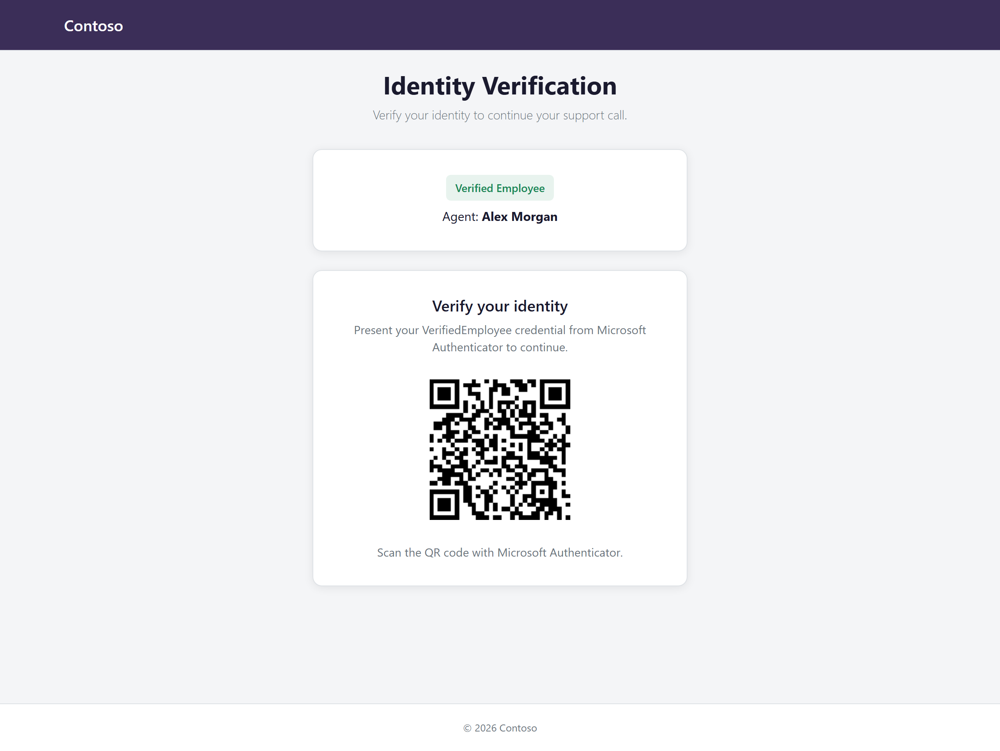
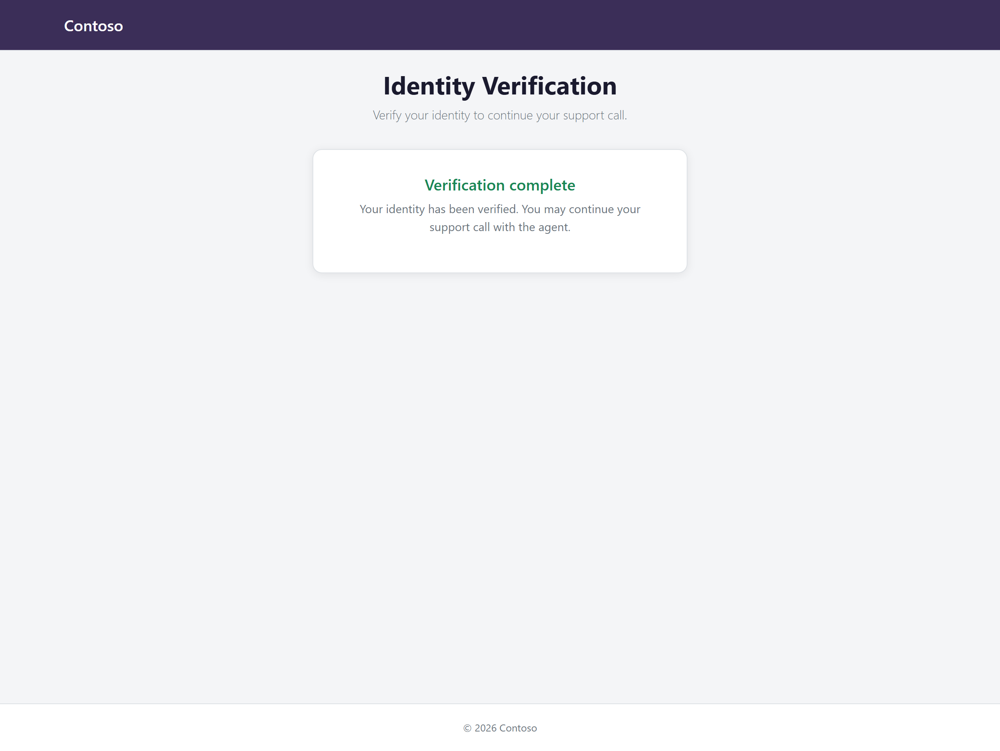

# Verified Helpdesk

Bidirectional identity verification for IT helpdesk calls using [Microsoft Entra Verified ID](https://learn.microsoft.com/en-us/entra/verified-id/). Any signed-in employee can initiate a session by presenting the managed **VerifiedEmployee** credential from Microsoft Authenticator; the other party verifies the same way.

Based on the Microsoft [`6-woodgrove-helpdesk`](https://github.com/Azure-Samples/active-directory-verifiable-credentials-dotnet/tree/main/6-woodgrove-helpdesk) sample, extended for agent-first bidirectional verification and fixed for standalone Azure App Service deployment.

## Features

- Employee Entra ID sign-in before starting a session
- Initiator presents VerifiedEmployee credential first
- Caller link (`/caller/{sessionId}`) shows verified initiator identity, then prompts caller verification
- App Service **Managed Identity** for Verified ID (no API secrets)
- Application Insights audit events per verification
- Configurable organization branding via app settings
- Face Check optional (disabled by default)

## How it works

A complete verification session walks the employee through four portal steps, then the caller through three steps on the shared link. Screenshots below use demo data (Contoso / fictional names).

### Employee portal

<table>
  <tr>
    <td align="center" width="50%">
      
      <br /><b>1. Start session</b><br /><sub>Sign in and start a new verification session</sub>
    </td>
    <td align="center" width="50%">
      
      <br /><b>2. Verify yourself</b><br /><sub>Present VerifiedEmployee via Microsoft Authenticator</sub>
    </td>
  </tr>
  <tr>
    <td align="center" width="50%">
      
      <br /><b>3. Send link to caller</b><br /><sub>Copy the caller URL and share it out of band</sub>
    </td>
    <td align="center" width="50%">
      
      <br /><b>4. Verification complete</b><br /><sub>See the caller's verified identity on screen</sub>
    </td>
  </tr>
</table>

### Caller link

<table>
  <tr>
    <td align="center" width="33%">
      
      <br /><b>1. Confirm agent</b><br /><sub>Verify the employee name and badge</sub>
    </td>
    <td align="center" width="33%">
      
      <br /><b>2. Verify identity</b><br /><sub>Present VerifiedEmployee via Authenticator</sub>
    </td>
    <td align="center" width="33%">
      
      <br /><b>3. Complete</b><br /><sub>Continue the support call with confidence</sub>
    </td>
  </tr>
</table>

See [Usage](#usage) for step-by-step instructions. To regenerate screenshots after UI changes, run `.\scripts\capture-readme-screenshots.ps1`.

## Architecture

```
Employee (signed in) → present VC → share caller link
Caller (anonymous) → sees verified employee → present VC → session complete → audit event
```

See [Verified helpdesk with Microsoft Entra Verified ID](https://learn.microsoft.com/en-us/entra/verified-id/helpdesk-with-verified-id) for the Microsoft reference pattern.

## Prerequisites

Gather these before starting setup:

1. **Entra ID tenant** with a verified custom domain (required for Verified ID Quick setup)
2. **Microsoft Entra Verified ID** with managed **VerifiedEmployee** and MyAccount issuance enabled — [Quick setup guide](https://learn.microsoft.com/en-us/entra/verified-id/verifiable-credentials-configure-tenant-quick)
3. **Issuer DID** from Entra admin center → Verified ID → Settings
4. **Tenant ID** from Entra admin center
5. **Azure subscription**
6. **GitHub repository** hosting this code (for App Service source control)
7. Entra ID role that can assign application permissions (for example **Cloud Application Administrator** or **Privileged Role Administrator**)

## Setup guide

Follow these steps in order.

### Step 1 — Configure Entra ID

1. Complete Verified ID Quick setup with the **VerifiedEmployee** credential and MyAccount issuance enabled.
2. Record your **issuer DID** and **tenant ID**.

### Step 2 — Register agent sign-in app

1. Choose a globally unique **webAppName** — your app URL will be `https://<webAppName>.azurewebsites.net`.
2. Create the agent sign-in app registration:

```powershell
.\scripts\register-agent-app.ps1 `
  -TenantId "<your-tenant-id>" `
  -AppName "Verified Helpdesk Portal" `
  -RedirectUri "https://<webAppName>.azurewebsites.net/signin-oidc"
```

3. Save the returned **client ID** for Step 3.

Requires `Install-Module Microsoft.Graph` and `Application.ReadWrite.All` consent.

### Step 3 — Deploy to Azure

The default deployment creates Application Insights for audit telemetry, which requires the `Microsoft.OperationalInsights` resource provider on your subscription. If you have never deployed monitoring resources, register providers first (requires subscription **Contributor** or **Owner**):

```powershell
.\scripts\register-azure-providers.ps1 -Wait
```

Or in [Azure Cloud Shell](https://portal.azure.com): clone this repo, then run the same command from the repo root.

[](https://portal.azure.com/#create/Microsoft.Template/uri/https%3A%2F%2Fraw.githubusercontent.com%2Fzachlowes%2FVerified-Helpdesk%2Fmain%2FARMTemplate%2Ftemplate.json)

Click **Deploy to Azure** and provide:

| Parameter | Description |
|-----------|-------------|
| `webAppName` | Globally unique App Service name |
| `DidAuthority` | Your Verified ID issuer DID |
| `AzureAdTenantId` | Entra ID tenant ID |
| `AzureAdClientId` | Client ID from Step 2 |
| `companyName` | Organization name shown in the portal (default: `Your Organization`) |
| `repoURL` | GitHub repo URL (default: `https://github.com/zachlowes/Verified-Helpdesk.git`) |
| `branch` | Branch to deploy (default: `main`) |
| `enableApplicationInsights` | Create Application Insights for audit events (default: `true`). Set to `false` on restricted subscriptions that cannot register `Microsoft.OperationalInsights`. The app works without it; audit telemetry is skipped. |

The template provisions an App Service Plan (Basic B1), Web App with system-assigned managed identity, optional Application Insights, GitHub source control integration, and required app settings.

To deploy from your own fork, set the `repoURL` parameter or update the Deploy button URL in your fork's README.

### Step 4 — Authorize GitHub deployment

In App Service → **Deployment Center**, complete GitHub authorization if prompted.

### Step 5 — Grant Managed Identity permissions

The app's **system-assigned managed identity** needs one application permission (not delegated):

| API | App role | Purpose |
|-----|----------|---------|
| Verified ID Request Service (`3db474b9-6a0c-4840-96ac-1fceb342124f`) | `VerifiableCredential.Create.PresentRequest` | Create presentation requests |

1. Confirm **System assigned identity** is enabled: App Service → **Identity** → **System assigned** → **On**.
2. Wait about one minute for the identity to propagate.
3. Run the helper script (local PowerShell or [Azure Cloud Shell](https://portal.azure.com)):

```powershell
# Cloud Shell: clone the repo first, then run from the repo root
git clone https://github.com/zachlowes/Verified-Helpdesk.git
cd Verified-Helpdesk

.\scripts\grant-msi-permissions.ps1 -TenantId "<your-tenant-id>" -AppName "<webAppName>"
```

If display-name lookup finds zero or multiple service principals, pass the **Object (principal) ID** from App Service → **Identity**:

```powershell
.\scripts\grant-msi-permissions.ps1 `
  -TenantId "<your-tenant-id>" `
  -AppName "<webAppName>" `
  -ServicePrincipalId "<object-id-from-identity-blade>"
```

Requires `Install-Module Microsoft.Graph` if not already installed.

4. Verify assignments in **Entra admin center → Enterprise applications** — search for your App Service name and open **Permissions**. Confirm **Service principal type** is **Managed identity**.

### Step 6 — Verify app settings

Confirm these in App Service → **Configuration** (full list in [`appservice-config-template.json`](appservice-config-template.json)):

| Setting | Purpose |
|---------|---------|
| `VerifiedID__DidAuthority` | Issuer DID |
| `VerifiedID__ManagedIdentity` | `true` on Azure |
| `AzureAd__TenantId` / `AzureAd__ClientId` | Employee sign-in |
| `APPLICATIONINSIGHTS_CONNECTION_STRING` | Set by ARM template when `enableApplicationInsights` is `true` |

If you skipped Step 2, run `register-agent-app.ps1` now and set `AzureAd__ClientId` manually.

## Usage

### Agent portal (4 steps)

Matches the on-screen **Step X of 4** flow in the verification portal.

1. **Start session** — Open the portal, sign in with your work account, and click **Start Verification**. ([screenshot](ReadmeFiles/demo-01-agent-start.png))
2. **Verify yourself** — Scan the QR code with Microsoft Authenticator and share your VerifiedEmployee credential. ([screenshot](ReadmeFiles/demo-02-agent-verify.png))
3. **Send link to caller** — After you are verified, copy the caller link and send it to the other person (SMS, email, Teams, etc.). ([screenshot](ReadmeFiles/demo-03-agent-share-link.png))
4. **Verification complete** — When the caller finishes, their verified name and email appear on screen. ([screenshot](ReadmeFiles/demo-04-agent-complete.png))

### Caller link (3 steps)

The caller opens `/caller/{sessionId}` from the link you shared.

1. **Confirm agent** — Check the verified employee badge and agent name before continuing. ([screenshot](ReadmeFiles/demo-05-caller-confirm-agent.png))
2. **Verify identity** — Scan the QR code and share your VerifiedEmployee credential from Microsoft Authenticator. ([screenshot](ReadmeFiles/demo-06-caller-verify.png))
3. **Complete** — Confirmation appears when verification succeeds; continue your support call. ([screenshot](ReadmeFiles/demo-07-caller-complete.png))

## Customization (branding)

Set these in App Service configuration — no code changes required:

| Setting | Default | Purpose |
|---------|---------|---------|
| `AppSettings__CompanyName` | `Your Organization` | Header display name |
| `AppSettings__CompanyLogo` | *(empty)* | Logo URL; hidden when empty |
| `AppSettings__PortalTitle` | `Verified Helpdesk` | Browser title |
| `AppSettings__AuthorizedAgentLabel` | `Verified Employee` | Badge shown to callers |
| `VerifiedID__client_name` | `Helpdesk Verification` | Verified ID presentation label |

Optional Face Check: set `VerifiedID__EnableFaceCheck` to `true`.

## Local development

1. Install [.NET 8 SDK](https://dotnet.microsoft.com/download/dotnet/8.0)
2. Copy `appsettings.json` values into User Secrets or `appsettings.Development.json` (gitignored)
3. For local Verified ID calls without MSI, set `VerifiedID__ManagedIdentity` to `false` and provide `VerifiedID__TenantId`, `VerifiedID__ClientId`, and `VerifiedID__ClientSecret`
4. Run:

```bash
dotnet run --project VerifiedHelpdesk.csproj
```

## Troubleshooting

| Problem | Likely cause | Fix |
|---------|--------------|-----|
| `Failed to register resource provider 'microsoft.operationalinsights'` | Monitoring resource providers not registered, or insufficient subscription permissions | Run [`register-azure-providers.ps1`](scripts/register-azure-providers.ps1) with `-Wait`, confirm status is **Registered**, then redeploy. Or deploy with `enableApplicationInsights=false`. |
| Default Azure placeholder page | Deploy failed | Check Deployment Center logs; confirm `deploy.cmd` exists at repo root |
| `deploy.cmd` not recognized | Monorepo `.deployment` without local `deploy.cmd` | Use this standalone repo, not the upstream subfolder (see note below) |
| MSB3026 / `VerifiedHelpdesk.dll` file in use during deploy | App is running while Kudu publishes directly to `wwwroot` | Pull latest `main` — [`deploy.cmd`](deploy.cmd) publishes to a staging folder, uses `app_offline.htm`, then copies to `wwwroot`. Retry **Sync** in Deployment Center. |
| Verified ID API 401/403 | MSI permissions missing | Run [`grant-msi-permissions.ps1`](scripts/grant-msi-permissions.ps1) |
| `Cannot convert value to type System.String` on `ServicePrincipalId` | Old script version, multiple service principals with the same name, or Graph SDK object binding issue | In Cloud Shell, run `git pull` in the repo (or re-clone) to get the latest script. Copy **Object (principal) ID** from App Service → **Identity** and re-run with `-ServicePrincipalId`. In Entra admin center, confirm the enterprise app shows **Managed identity** as the service principal type. |
| Sign-in fails | App registration misconfigured | Verify redirect URI matches `https://<app>.azurewebsites.net/signin-oidc` |
| Session expired | In-memory cache TTL | Restart verification; increase `AppSettings__CacheExpiresInSeconds` if needed |
| `Get-MgApplication` / `New-MgApplication`: One or more errors occurred | Hidden inner error (usually module conflict or missing admin consent) | See [App registration script errors](#app-registration-script-errors) below |

View logs: App Service → **Log stream**, or Application Insights → **Logs** (query `customEvents` for `VerificationCompleted` / `VerificationFailed`).

### App registration script errors

If [`register-agent-app.ps1`](scripts/register-agent-app.ps1) fails with `Get-MgApplication` or `New-MgApplication: One or more errors occurred`, the script prints the underlying Graph error and suggested fix. Re-run the script to see the detailed message.

**Important:** Run the script in a **fresh PowerShell window**. Do not import Exchange Online or PnP modules in the same session before Graph — they conflict with Microsoft.Graph and cause opaque AggregateException errors on every Graph cmdlet.

For manual diagnosis in the same PowerShell session after a failure:

```powershell
Get-Error | Format-List * -Force
# or
$Error[0].Exception.InnerExceptions | ForEach-Object { $_.Message }
```

Common causes and fixes:

| Inner error | Fix |
|-------------|-----|
| `Authorization_RequestDenied` / `Insufficient privileges` | Sign in with **Cloud Application Administrator** or **Global Administrator**. Accept admin consent for `Application.ReadWrite.All` during `Connect-MgGraph`. If tenant policy blocks user app registration, use an admin account or create the app manually in Entra admin center. |
| `Could not load file or assembly` / `TypeLoadException` | Multiple Microsoft.Graph module versions conflict. Uninstall all `Microsoft.Graph*` modules, reinstall in a fresh PowerShell window: `Install-Module Microsoft.Graph -Scope CurrentUser -Force`. Do not import Exchange Online or PnP modules in the same session before Graph. |
| App already exists | The script detects an existing registration by display name and prints the client ID. Confirm the redirect URI under **Authentication** in Entra admin center. |

**Manual fallback** (same result as the script):

1. Entra admin center → **Applications** → **App registrations** → **New registration**
2. Name: your app name (e.g. `Verified Helpdesk Portal`)
3. Supported account types: **Accounts in this organizational directory only**
4. Redirect URI: **Web** → `https://<webAppName>.azurewebsites.net/signin-oidc`
5. After creation: **Authentication** → **Implicit grant** → enable **ID tokens**
6. Copy the **Application (client) ID** for `AzureAdClientId` in the ARM deploy

**Why this repo deploys when the upstream sample does not:** The Microsoft monorepo uses a root `.deployment` file that runs `cd %PROJECT% && deploy.cmd`, but the `6-woodgrove-helpdesk` subfolder has no `deploy.cmd`. Kudu fails with `'deploy.cmd' is not recognized as an internal or external command`. This repository is a **standalone app at the repo root** with its own [`deploy.cmd`](deploy.cmd) and [`.deployment`](.deployment) file — no `PROJECT` subfolder required.

## Project structure

```
Verified-Helpdesk/
├── ARMTemplate/template.json   # Deploy to Azure
├── ReadmeFiles/                # README images (demo walkthrough, deploy button)
├── deploy.cmd / .deployment    # Kudu custom deploy
├── Controllers/                # Agent, Caller, API, Callback
├── Services/                   # Session, Audit, Verified ID
├── scripts/                    # MSI, app registration, screenshot capture, Azure helpers
└── Views/                      # Agent and caller portals
```

## License and attribution

Application code is derived from [Azure-Samples/active-directory-verifiable-credentials-dotnet](https://github.com/Azure-Samples/active-directory-verifiable-credentials-dotnet) (MIT License).

Microsoft documentation:

- [Verified helpdesk pattern](https://learn.microsoft.com/en-us/entra/verified-id/helpdesk-with-verified-id)
- [VerifiedEmployee credential](https://learn.microsoft.com/en-us/entra/verified-id/how-to-use-quickstart-verifiedemployee)
- [App Service Managed Identity](https://learn.microsoft.com/en-us/azure/app-service/overview-managed-identity)
